Integración de Red Hat Insights con Red Hat Ansible Tower

- [Registrar las servidores a Red Hat Insights](#registrar-las-servidores-a-red-hat-insights)
- [Registrar los nodos en Ansible Tower](#registrar-los-nodos-en-ansible-tower)
- [Revisar el portal de Red Hat Insights](#revisar-el-portal-de-red-hat-insights)
- [Aplicar la remediation en sus maquinas a partir de Insights y Tower](#aplicar-la-remediation-en-sus-maquinas-a-partir-de-insights-y-tower)
  * [Red Hat Insights Advisor](#red-hat-insights-advisor)
  * [Red Hat Insights Vulnerability](#red-hat-insights-vulnerability)
- [Información adicional](#Información-adicional)


El objetivo de este documento es mostrar el paso a paso para realizar la integración de Red Hat Insights con Ansible Tower y asi garantizar la automatización de muchas tareas relacionadas con la operación que le harán la vida mas fácil a los administradores y también poder contar por lo menos con un aseguramiento mínimo sugerido por algunas de las normas internacionales.

Para este ambiente se contaba previamente con:
* Un Red Hat Ansible Tower recién instalado (all in one)
* Una maquina virtual que funciona como cliente con RHEL 7.8
* Una suscripción activa de Red Hat
* Un playbook de des aseguramiento de la maquina (en pro de emular un sistema operativo con problemas) ubicado en este repo en /playbooks/insecure-vm.yml

Vamos a iniciar realizando los siguientes pasos:

## Registrar las servidores a Red Hat Insights

1.  Suscribir maquina con su usuario y contraseña de Red Hat a traves del comando subscription-manager
```bash
[root@node01 ~]# subscription-manager register
Registering to: subscription.rhsm.redhat.com:443/subscription
Username: jcalvo@redhat.com
Password:
The system has been registered with ID: 8c00b1e6-dc02-4363-badd-3b10858f3379
The registered system name is: node01.jmanuelcalvo.com
```

2. Adjuntar el sistema operativo a una suscripción activa
```bash
[root@node01 ~]# subscription-manager attach --pool=XXXXXXXXXXXXXXXXXXX
Successfully attached a subscription for: Employee SKU
```
> Nota: 
> 
> En caso de no conocer el pool de la suscripción puede ejecutar el comando `subscription-manager list --available` 

3. Habilitar el repositorio donde se encuentra los paquetes de Red Hat Insights
```bash
[root@node01 ~]# subscription-manager repos --enable=rhel-7-server-insights-3-rpms
Repository 'rhel-7-server-insights-3-rpms' is enabled for this system.
```
> Nota:
>
> Este paso es unicamente requerido para *RHEL 7*, ya que *RHEL 8* ya tiene habilitados los paquetes de insights por defecto
>
> En caso que quiera validar los múltiples repositorios dados por la suscripción puede ejecutar el comando `subscription-manager repos --list`

4. Instalar el paquete de Red Hat Insights
```bash
[root@node01 ~]# yum install insights-client
...
...
Installed:
  insights-client.noarch 0:3.0.13-1.el7_7

Complete!
```

5. Registrar la maquina a Red Hat Insights
```bash
[root@node01 ~]# insights-client --register
Successfully registered host node01.jmanuelcalvo.com
Automatic scheduling for Insights has been enabled.
Starting to collect Insights data for node01.jmanuelcalvo.com
Uploading Insights data.
Successfully uploaded report for node01.jmanuelcalvo.com.
View the Red Hat Insights console at https://cloud.redhat.com/insights/
View details about this system on cloud.redhat.com:
https://cloud.redhat.com/insights/inventory/1616ef27-d477-40ae-9c4e-a9c4f29b78f0
```

6. Ingresar al portal de cloud.redhat.com y validar dentro del inventario que las maquinas quedaron registradas, puede ingresar al portal principal del Red Hat Insights o al url devuelto por el comando de registro, el cual lo llevara directamente al inventario

https://cloud.redhat.com/insights/
https://cloud.redhat.com/insights/inventory/1616ef27-d477-40ae-9c4e-xxxxx

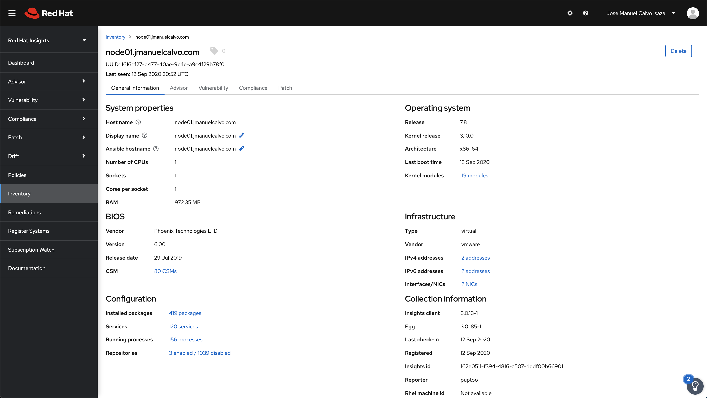

> Consejo
> 
> Si no quiere realizar estos pasos de forma manual o requiere realizarlos sobre múltiples servidores, puede hacerlo a través de este playbook

```yaml
---
- hosts: all
  gather_facts: yes
  tasks:
  - name: Registar las maquinas al pool XXXXX SKU
    redhat_subscription:
      state: present
      username: jcalvo@redhat.com
      password: XXXXXXX
      pool_ids: XXXXXXXXXXXXXXXXXXX

  - name: Habiliar repositorio de insights
    rhsm_repository:
      name: rhel-7-server-insights-3-rpms

  - name: Instalar paquete de Red Hat Insights
    yum:
      name: insights-client
      state: latest

  - name: Registrar maquina en insights
    shell: insights-client --register
    register: salida

  - name: Mensaje de salida registro
    debug:
      var: salida  
```

## Registrar los nodos en Ansible Tower


1. Registrar el usuario y contraseña utilizados en Red Hat Insights dentro del Ansible Tower, para ello desde la interface de Ansible Tower ir a:

Credentials -> Adicionar credenciales  

En el campo **Tipo de credencial**, ingrese Insights o haga clic en el botón y selecciónelo en la ventana emergente del tipo de credencial.


y rellene los campos con los mismos datos de Registro de la maquinas y los del portal **Red Hat Customer Portal**

Haga clic en **Save** cuando termine


2. Crear un proyecto de integración con Red Hat Insights, desde la interface de Ansible Tower ir a:

Projects -> Adicionar proyecto 

El campo **Credential** se rellena previamente con las credenciales de Insights que creó anteriormente. De lo contrario, ingrese la credencial o haga clic en el botón y selecciónelo en la ventana emergente.

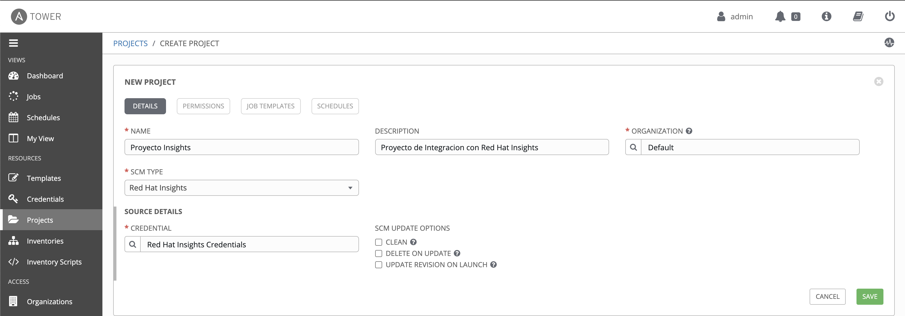

Haga clic en **Save** cuando termine

Una vez creado el proyecto, este intentara sincronizar con los playbooks que se tengan creados en el portal cloud.redhat.com

> NOTA:
>
> Puede suceder que la primera sincronización falle por timeout, intente nuevamente sincronizar de forma manual luego de 5 minutos

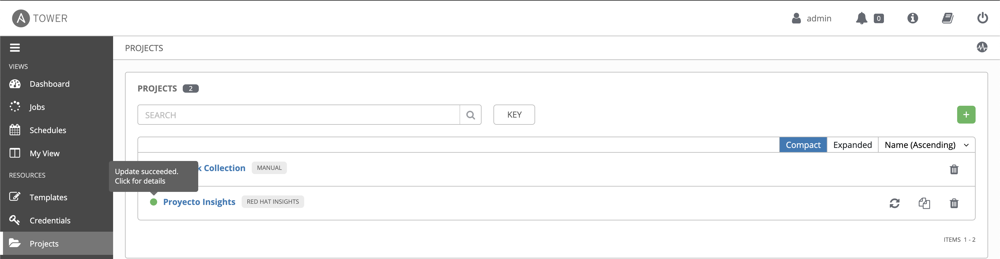

3. Crear un inventario con los hosts ingresados a Red Hat Insights para la integración, desde la interface de Ansible Tower ir a:

Inventories ->  -> Inventory


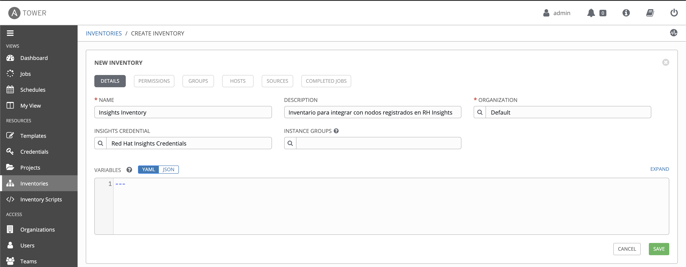

Haga clic en **Save** cuando termine

Una vez creado el inventario, se deben vincular los hosts previamente registrados, dentro del inventario vaya a :

Hosts -> 

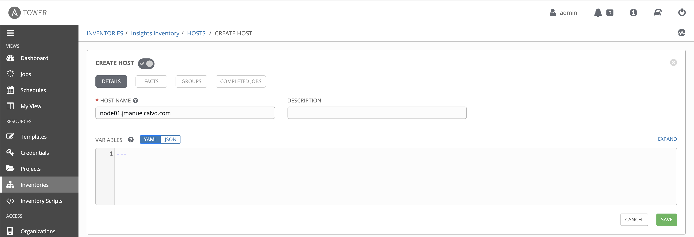

Haga clic en **Save** cuando termine

4. Creación de un proyecto adicional de escaneo

Para que Ansible Tower pueda utilizar los planes de mantenimiento de Insights, debe tener visibilidad para ellos. Cree y ejecute un job/trabajo de escaneo en el inventario utilizando un playbook de escaneo manual, desde la interface de Ansible Tower ir a:

Projects ->  -> Inventory

Puede utilizar este repositorio de git que contiene los playbooks de escaneo.

https://github.com/ansible/awx-facts-playbooks

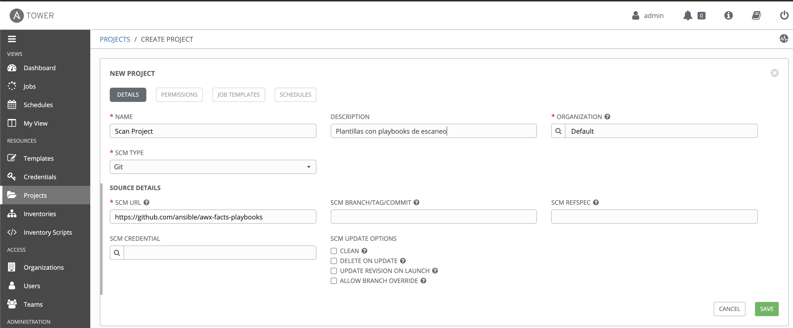


Haga clic en **Save** cuando termine

5. Crear un Trabajo/Job de escaneo/integración para habilitar el botón de Insights en los Hosts

Desde la interface de Ansible Tower ir a:

Templates ->  -> Job Template

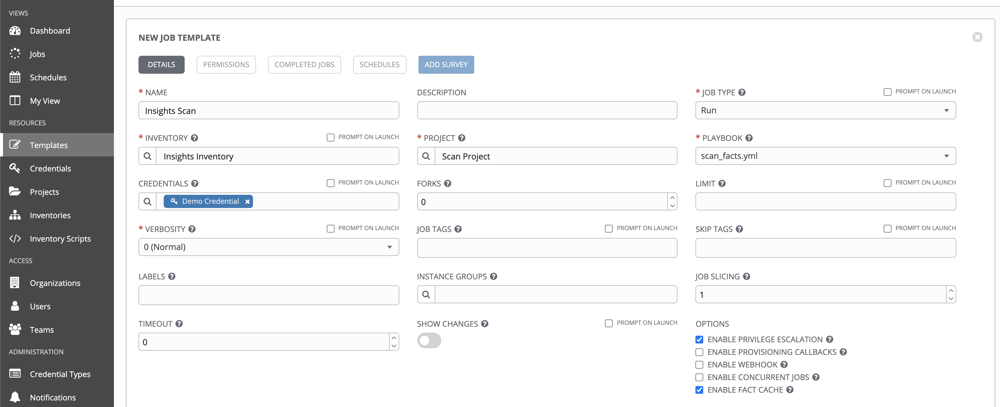


- Job Type: Seleccionar **Run** 

- Playbook: Seleccione scan_facts.yml

- Credential: Estas credenciales deben coincidir con las de los sistemas operativos del inventario de Insights. Las credencial no tiene que ser una credencial de Insights, deben ser de maquinas **tipo machine**.

* Haga clic para seleccionar Habilitar **Enable Privilege Escalation**  y **Enable Fact Cache** en el campo Opciones.

Haga clic en **Save** cuando termine


> NOTA:
>
> Lo que hace es activar el botón **Insights**  del Host, que es necesario para corregir el inventario de Insights. De lo contrario, el parámetro system_id en el resultado de su trabajo de escaneo se establece en nulo y el botón Insights no aparecerá.

6. Ahora click en el botón del cohete para ejecutar el playbook


y validar que la ejecución finalice de forma correcta


7. Si la integración funciono de forma correcta, puede ir al inventario de Insights previamente creado y dentro de los hosts debe visualizar una nueva pestaña **INSIGHTS**,  desde la interface de Ansible Tower ir a:

Inventories -> Insights Inventory -> Pestaña HOSTS

y ingresando al nodo que coincide con el previamente registrado deberá visualizar la pestaña **INSIGHTS** la cual contiene información relacionada con los diferentes problemas reportados en la maquinas

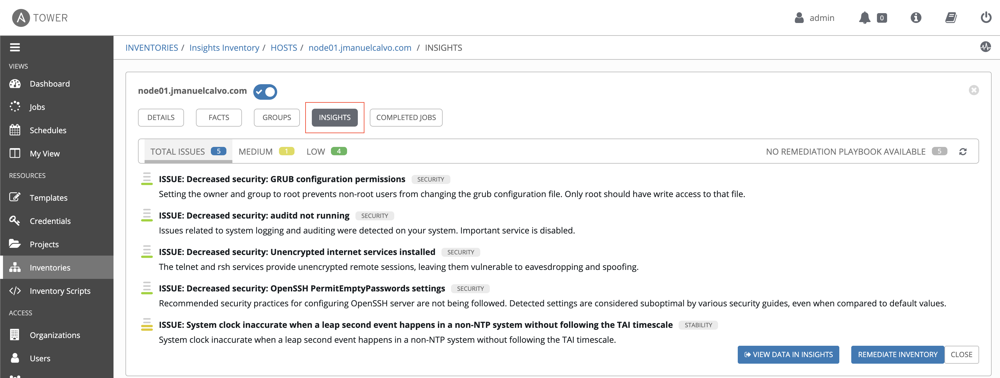


## Revisar el portal de Red Hat Insights

El botón **VIEW DATA IN INSIGHTS** nos llevara directamente al portal y a nuestras maquinas, donde a través de este portal predictivo podremos tener una panel que permite conocer el estado de salud de toda nuestra infraestructura

 

Red Hat Insights permite validar y automatizar múltiples tareas relacionadas con los sistemas operativos y las aplicaciones allí instaladas, utilizando los servicios de:

* Servicio de **Advisor** para la evaluación y seguimiento de problemas de configuración de RHEL.

* Servicio de  **Vulnerability** para evaluar y monitorear el estado de las vulnerabilidades de seguridad en sus sistemas RHEL

* Servicio de **Patch** que aprovecha la experiencia en automatización de gestión y software de Red Hat para permitir flujos de trabajo de parches consistentes para los sistemas RHEL en su nube híbrida abierta

* Servicio de **Drift** o comparación de sistemas le permite comparar la configuración del sistema, de un sistema con otros sistemas en su inventario de servicios de administración en la nube.

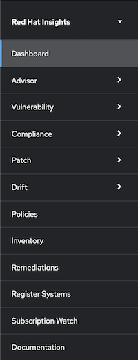 


y todo esto lo podrá visualizar también desde un tablero único/Dashboard lo que le permitirá contar con una visual completa de su infraestructura en tiempo real.

## Aplicar la remediation en sus maquinas a partir de Insights y Tower

### Red Hat Insights Advisor 

Desde la interface web https://cloud.redhat.com/insights/ ir a:

Advisor -> Recommendations

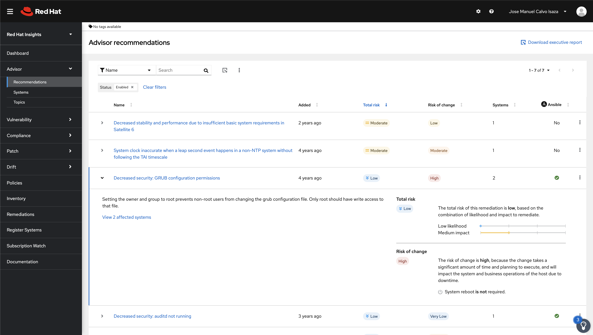 

Desde aquí podrá visualizar las recomendaciones de configuraciones, su nivel de riesgo, a cuantos de sus sistemas los afecta y si cuentan con un playbook para su remediacion/solución asi como también una breve descripción de la afectación

También es posible encontrar el paso a paso de como solucionar o aplicar dicha recomendación ingresando a:

Advisor -> Systems -> ``nombre del servidor``

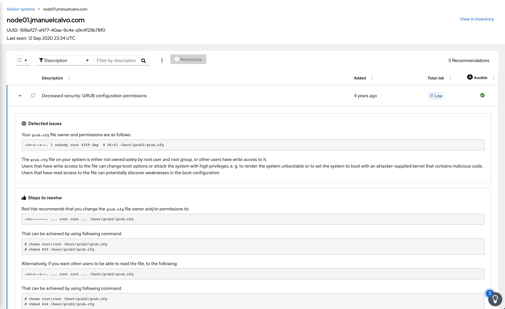 

o generar un playbook que se encargue de automatizar estas tareas por nosotros, para ellos seleccionamos todas las recomendaciones y damos click en el icono que tiene el logo de **Ansible** llamado Remediate 

Una ventana emergente nos permite crear un nuevo playbook o adicionar las tareas a un playbook existente 

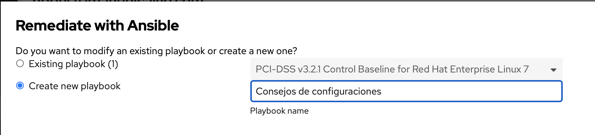 

Luego hacemos click en **Next** donde encontraremos información relacionada con las tareas que se van a automatizar y por ultimo click en **Create**

Si ingresamos al menú Remediations al lado izquierdo podemos visualizar la tares

https://cloud.redhat.com/insights/remediations

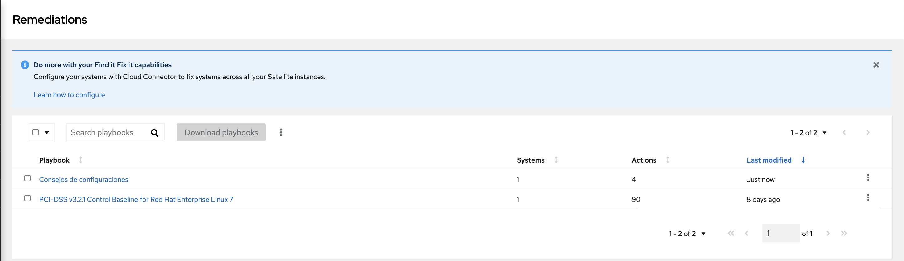 

Teniendo en cuenta Ansible Tower y Red Hat Insights se encuentran integradas, podemos ejecutar estos Playbooks desde Ansible Tower ingresando a:

Inventories -> Insights Inventory -> 

Este icono nos lleva directamente a la creación de un trabajo/Job Template para aplicar los playbooks

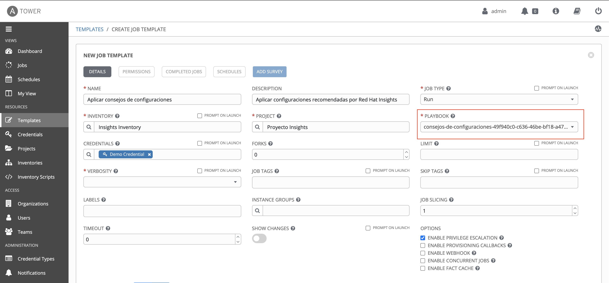 

Como se puede visualizar en lineas rojas, el playbook tiene el mismo nombre que se creo desde la interface de Red Hat Insights

* Haga clic para seleccionar Habilitar **Enable Privilege Escalation**  ya que este playbook seguramente contiene actualización de paquetes y cambios en archivos de configuración que solo el usuario root puede hacer

> NOTA:
>
> En caso que los playbooks no coincidan con los del Red Hat Insights, vaya al proyecto Proyecto Insights y haga click en el botón de actualizar

Haga clic en **Save** y luego click en **LAUNCH** en caso que desee ejecutar el playbook en este momento.

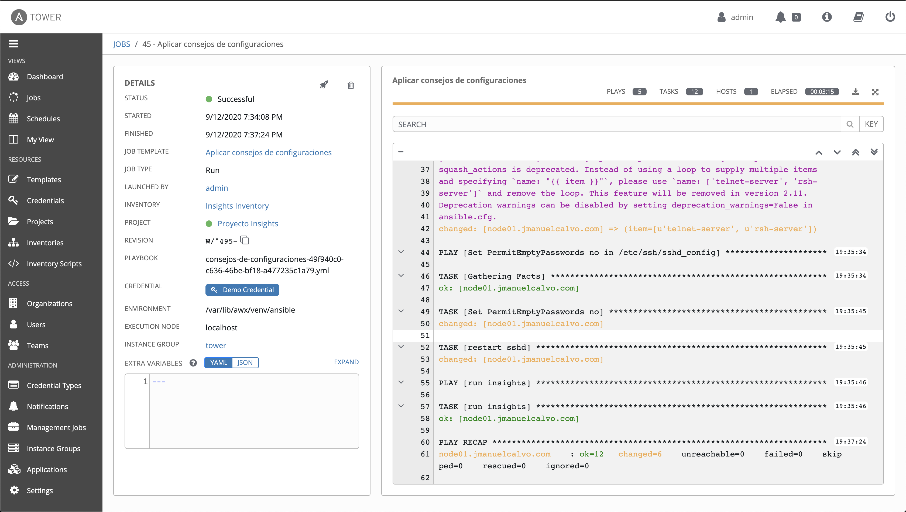 

El playbook se ejecuta sobre las maquinas afatadas y su ultima tarea es ejecutar nuevamente el comando ``insights-client`` el cual se encarga de sincronizarse de forma manual con el portal de insights para enviar las nuevos estados de la maquina.


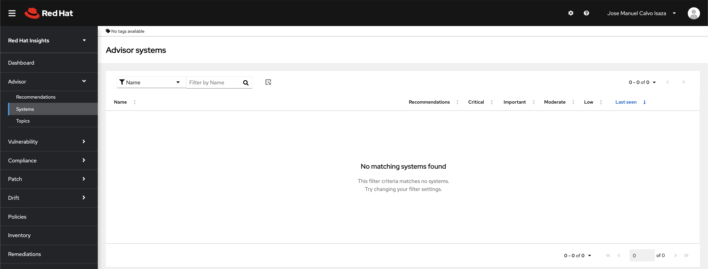 

Y teniendo en cuenta que se aplicaron todas las remediaciones a la maquina, dentro del servicio de **Advice** por ahora no se ve ningún sistema con algún consejo para aplicar


### Red Hat Insights Vulnerability 

Desde la interface web https://cloud.redhat.com/insights/ ir a:

Vulnerability -> CVEs

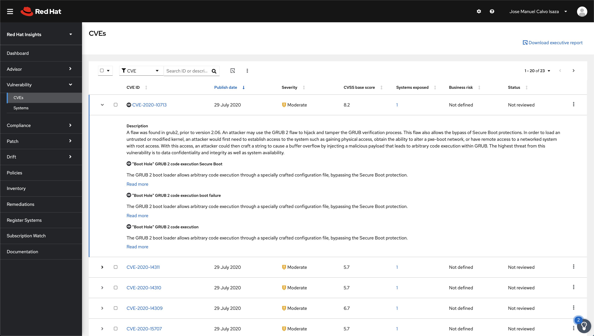 

Desde aquí podrá visualizar las vulnerabilidades que afectan a sus sistemas, asi como sus CVE's (Common Vulnerabilities and Exposures) o Vulnerabilidades y exposiciones comunes que afectan a sus sistemas con su respectivo ID y link donde se puede visualizar mayor informacion, su dato de publicacion, su nivel de severidad, su puntuacion, a cuantos de sus sistemas los afecta.

También es posible encontrar un resumen con los servidores por los cuales son afectados estas vulnerabilidades

Vulnerability -> Systems -> ``nombre del servidor``

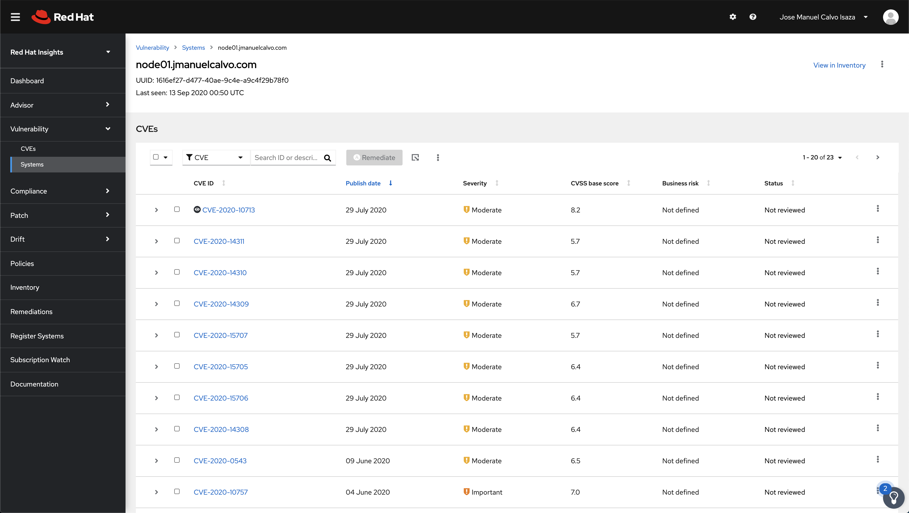 

Desde este panel podemos seleccionar una a una los CVE's que deseamos solucionar o seleccionarlos todos para posteriormente crear un playbook que se encargue de automatizar estas tareas por nosotros, para ellos seleccionamos todas las CVE's y damos click en el icono que tiene el logo de **Ansible** llamado Remediate 

Una ventana emergente nos permite crear un nuevo playbook o adicionar las tareas a un playbook existente 

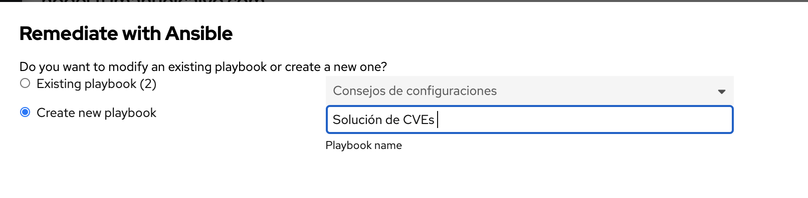 

Luego hacemos click en **Next** donde encontraremos información relacionada con las tareas que se van a automatizar y por ultimo click en **Create**

Si ingresamos al menú Remediations al lado izquierdo podemos visualizar la tares

https://cloud.redhat.com/insights/remediations

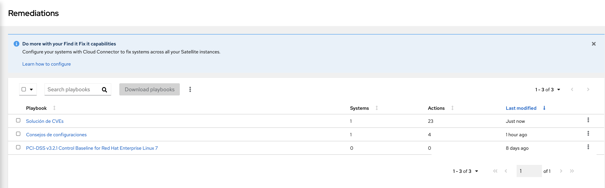 

Teniendo en cuenta Ansible Tower y Red Hat Insights se encuentran integradas, podemos ejecutar estos Playbooks desde Ansible Tower ingresando a:

Inventories -> Insights Inventory -> 

Este icono nos lleva directamente a la creación de un trabajo/Job Template para aplicar los playbooks

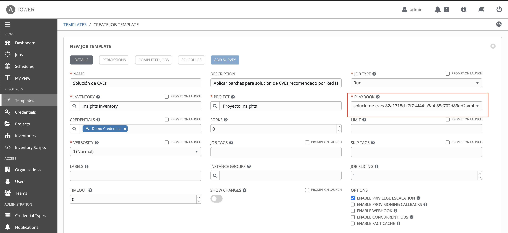 

Como se puede visualizar en lineas rojas, el playbook tiene el mismo nombre que se creo desde la interface de Red Hat Insights

* Haga clic para seleccionar Habilitar **Enable Privilege Escalation**  ya que este playbook seguramente contiene actualización de paquetes y cambios en archivos de configuración que solo el usuario root puede hacer

> NOTA:
>
> En caso que los playbooks no coincidan con los del Red Hat Insights, vaya al proyecto Proyecto Insights y haga click en el botón de actualizar

Haga clic en **Save** y luego click en **LAUNCH** en caso que desee ejecutar el playbook en este momento.

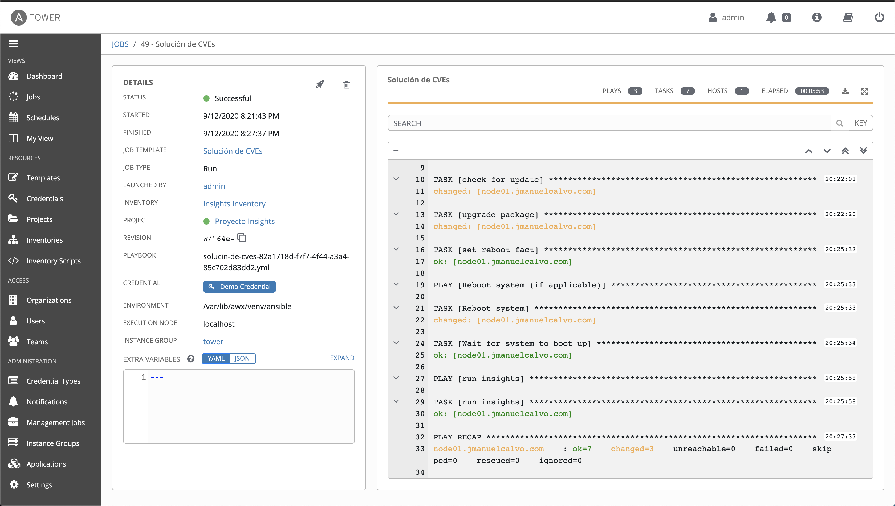 

El playbook se ejecuta sobre las maquinas afatadas y su ultima tarea es ejecutar nuevamente el comando ``insights-client`` el cual se encarga de sincronizarse de forma manual con el portal de insights para enviar las nuevos estados de la maquina.

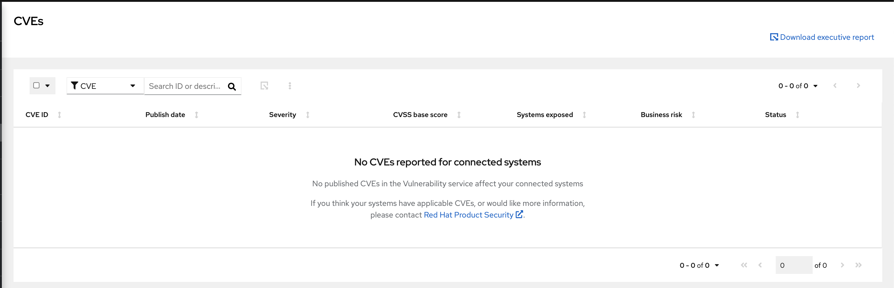 

Y teniendo en cuenta que se aplicaron todas las remediaciones a la maquina, dentro del servicio de **Vulnerabity** por ahora no se ve ningún sistema con algún consejo para aplicar

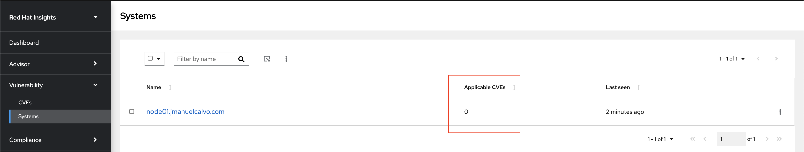 

y en la información del sistema se puede observar que no hay CVE's aplicables

Tambien se puede visualizar desde la inteface web de Ansible Tower que no hay remediaciones disponibles.

INVENTORIES -> Insights Inventory -> HOSTS -> node ->  INSIGHTS

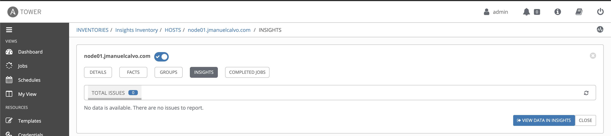 


## Información adicional

Para mayor información y/o actualización del procedimiento de integración,  puede visitar en el sitio oficial de Ansible en:

 - [Setting up an Insights Project](https://docs.ansible.com/ansible-tower/latest/html/userguide/insights.html)


